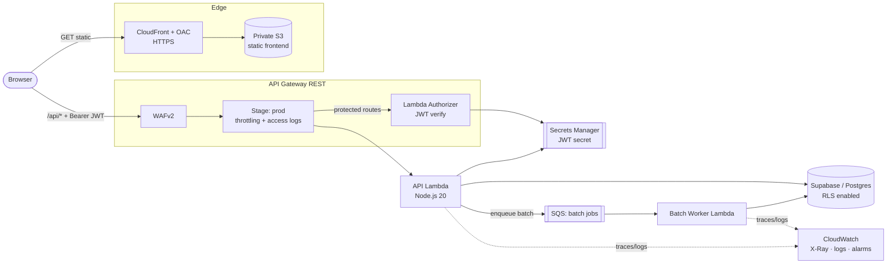
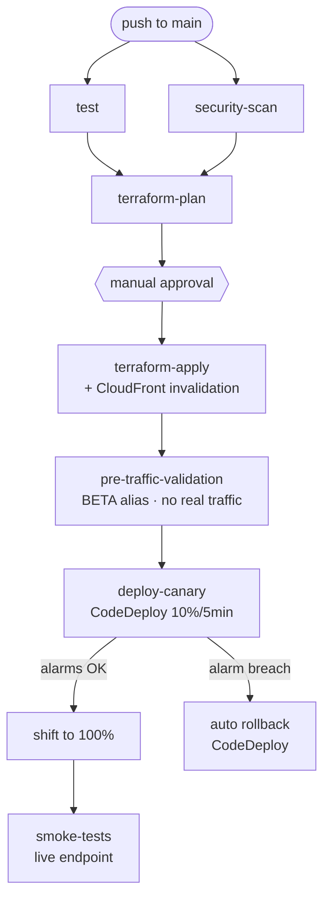

# Payment Transaction Simulator

A cloud-native payment-processing **simulator** that generates ISO 8583-style
transactions, runs configurable load tests, and stores results — built to
demonstrate **secure, observable, automated AWS infrastructure**, not to move
real money.

> **Focus of this project:** infrastructure security, reliability, automation,
> and cloud best practices. The application layer is intentionally small so the
> platform work stays front and center.

---

## Highlights

- **Serverless backend** — an API Lambda (Node.js 20) behind API Gateway,
  plus a dedicated async worker Lambda for batch load tests.
- **Real JWT authentication** — bcrypt-hashed credentials, HS256 tokens, and a
  dedicated **Lambda authorizer** that enforces auth at the API Gateway edge.
  Login is timing-safe (a wrong username costs the same as a wrong password).
- **Async batch processing** — `POST /api/process-batch` enqueues to SQS and
  returns immediately; a separate worker Lambda processes the simulated load
  test in the background, with `GET /api/batches/{id}` for progress polling.
  This keeps the request/response Lambda from blocking for the full duration
  of a load test.
- **Secrets in AWS Secrets Manager** — read at runtime, never baked into the
  Lambda environment; least-privilege IAM.
- **Private edge delivery** — S3 is fully private; the frontend is served only
  through CloudFront over HTTPS using **Origin Access Control (OAC)**.
- **Defense in depth** — WAFv2 (managed rules + a general rate limit + a
  stricter rate limit specifically on `/api/login`), API Gateway throttling,
  strict per-origin CORS (no wildcards), and **PAN masking** so no full card
  number is ever persisted or logged.
- **Observability as code** — X-Ray tracing, structured JSON access logs, a
  CloudWatch dashboard, alarms wired to SNS (including the batch worker and
  its dead-letter queue), and an AWS Budget guardrail.
- **CI/CD** — GitHub Actions with OIDC (no static AWS keys), automated tests,
  IaC security scanning, a manual approval gate, and a blue/green Lambda
  rollout that validates the new version against **no real traffic** before
  shifting any, then an **AWS CodeDeploy** Lambda canary (10%/5min) that
  auto-rolls-back on CloudWatch alarms, and a post-deploy smoke test.

---

## Architecture



**Request flow (protected route):** browser sends `Authorization: Bearer <jwt>`
→ WAF filters → API Gateway invokes the Lambda authorizer → authorizer verifies
the JWT (secret from Secrets Manager) and returns an IAM allow/deny → on allow,
the main Lambda runs, reads/writes Supabase (PAN masked), and emits X-Ray traces
and structured logs.

**Batch flow:** `POST /api/process-batch` validates the request, writes a
`batches` row, and enqueues a message to SQS, returning `202` with a
`batch_id` immediately. The batch worker Lambda drains the queue, simulates
each transaction, and updates the `batches` row roughly every 10%. The client
polls `GET /api/batches/{id}` for status.

---

## Tech stack

| Layer          | Technology                                                        |
|----------------|-------------------------------------------------------------------|
| Frontend       | React 18, TypeScript, Vite, Tailwind CSS                          |
| Backend        | AWS Lambda (Node.js 20), API Gateway (REST), SQS (async batches)  |
| Auth           | JSON Web Tokens (HS256), bcryptjs, API Gateway Lambda authorizer  |
| Data           | Supabase (PostgreSQL) with Row Level Security                     |
| Secrets        | AWS Secrets Manager                                               |
| Edge / CDN     | Amazon CloudFront + OAC, private S3                               |
| Security       | AWS WAFv2, API Gateway throttling, IAM least privilege           |
| Observability  | AWS X-Ray, CloudWatch (logs, dashboard, alarms), SNS, AWS Budgets |
| IaC            | Terraform (S3 remote state + DynamoDB locking, encrypted)        |
| CI/CD          | GitHub Actions (OIDC), tfsec, Checkov, npm audit                 |
| Tests          | node:test (Lambda), Vitest (frontend)                            |

---

## Repository structure

```
.
├── frontend/            # React app (Vite). Served via CloudFront.
│   └── src/
│       ├── services/    # api.ts (fetch + Bearer), auth.ts (JWT storage)
│       └── components/
├── lambda/              # API Lambda + authorizer + async batch worker
│   ├── lambda.js        # Main handler (login, transactions, batch enqueue)
│   ├── batch-worker.js  # SQS-triggered async batch processor
│   ├── shared.js        # Shared masking / ISO 8583 / Supabase helpers
│   ├── authorizer.js    # API Gateway TOKEN authorizer
│   ├── secrets.js       # Runtime JWT-secret resolver (Secrets Manager)
│   └── test/            # node:test suite
├── terraform/           # All infrastructure as code
│   ├── main.tf          # Region data source + Lambda deployment package (S3/zip)
│   ├── frontend.tf      # Private S3 + CloudFront + OAC
│   ├── lambda_api_gateway.tf  # Lambda, API Gateway, authorizer, throttling
│   ├── batch-worker.tf  # SQS queue + DLQ + worker Lambda + alarms
│   ├── secrets.tf       # Secrets Manager
│   ├── waf.tf           # WAFv2 Web ACL + association
│   ├── observability.tf # Dashboard, alarms, SNS, access-log group
│   ├── budget.tf         # AWS Budgets guardrail
│   ├── codedeploy.tf    # CodeDeploy app + group (Lambda canary + rollback)
│   └── *.tf             # state backend, variables, outputs
├── supabase/
│   ├── schema.sql       # Table definitions (transactions, batches)
│   └── rls.sql          # Row Level Security lockdown
├── .github/workflows/
│   └── ci-cd.yml        # test → scan → plan → approve → apply → pre-traffic → CodeDeploy canary → smoke
└── README.md
```

---

## Configuration

The pipeline reads everything from GitHub **Secrets** and **Variables** —
nothing sensitive lives in the repo.

### GitHub Actions Secrets

| Secret                 | Purpose                                                        |
|------------------------|------------------------------------------------------------------|
| `AWS_REGION`           | Deployment region (e.g. `us-east-1`)                           |
| `AWS_DEPLOY_ROLE_ARN`  | IAM role assumed via OIDC (no static keys)                     |
| `TF_STATE_BUCKET`      | S3 bucket for Terraform state (passed via `-backend-config`, never hardcoded) |
| `TF_STATE_LOCK_TABLE`  | DynamoDB table for Terraform state locking                     |
| `SUPABASE_URL`         | Supabase project URL                                           |
| `SUPABASE_KEY`         | Supabase **service_role** key (server-side only — never the anon key; see `supabase/rls.sql`) |
| `JWT_SECRET`           | Long random string used to sign/verify JWTs                    |
| `ADMIN_USERNAME`       | Admin login username                                           |
| `ADMIN_PASSWORD_HASH`  | **bcrypt hash** of the admin password (never plaintext)       |

### GitHub Actions Variables

| Variable             | Purpose                                                          |
|----------------------|--------------------------------------------------------------------|
| `VITE_API_BASE_URL`  | API Gateway stage URL, e.g. `https://xxxx.execute-api.<region>.amazonaws.com/prod` (no trailing `/api`) |

### Optional Terraform variables

`alarm_email` (subscribe to alarm/budget notifications), `monthly_budget_usd`
(default `10`), and `allowed_merchant_id` (default `demo-merchant`).

### Generating the password hash

```bash
node -e "console.log(require('bcryptjs').hashSync('YOUR_PASSWORD', 10))"
```

---

## Local development

```bash
# Frontend
cd frontend
npm install
echo "VITE_API_BASE_URL=https://<your-api>.execute-api.<region>.amazonaws.com/prod" > .env.local
npm run dev        # http://localhost:5173
npm test           # Vitest

# Lambda (unit tests use a JWT_SECRET fallback; no AWS needed. With no
# SQS_QUEUE_URL set, process-batch runs the worker in-process instead of
# requiring a real queue.)
cd ../lambda
npm install
npm test           # node:test
```

To let the local dev origin talk to a deployed API, add it to the Lambda's
`ALLOWED_ORIGINS` (comma-separated) in `terraform/lambda_api_gateway.tf`.

---

## Deployment

Infrastructure is managed entirely by Terraform and driven by CI/CD.

1. **Bootstrap once:** create the S3 state bucket + DynamoDB lock table, and
   the OIDC deploy role. Record the bucket/table names as the
   `TF_STATE_BUCKET` / `TF_STATE_LOCK_TABLE` secrets — they're never written
   into `terraform/backend.tf`.
2. **Set** the GitHub Secrets/Variables above.
3. **Apply the Supabase schema and RLS**: run `supabase/schema.sql` then
   `supabase/rls.sql`, and switch `SUPABASE_KEY` to the service_role key.
4. **Push to `main`** — the pipeline runs. The very first run needs
   `VITE_API_BASE_URL`; because API Gateway's ID is stable across deploys, set it
   once from the `api_gateway_invoke_url` output and re-run.

### CI/CD pipeline



```
push → test ─┐
             ├─ terraform-plan ─ manual-approval ─ terraform-apply
   security-scan ─┘                                     │
                                                         ▼
                                          pre-traffic-validation (BETA alias,
                                          no real traffic — aws lambda invoke)
                                                         │
                                                         ▼
                                    deploy-canary (AWS CodeDeploy Lambda
                                    canary 10%/5min · auto-rollback on alarms)
                                                         │
                                                         ▼
                                        smoke-tests (against live API/CDN)
```

- **test** — Lambda + frontend unit tests.
- **security-scan** — tfsec + Checkov on Terraform, `npm audit` on both packages.
- **manual-approval** — human gate (blocked unless tests and scans pass).
- **terraform-apply** — builds the frontend, applies infra, uploads the bundle,
  and invalidates the CloudFront cache.
- **pre-traffic-validation** — invokes the new Lambda version (BETA alias)
  directly, bypassing API Gateway and real users entirely, before any real
  traffic is shifted onto it.
- **deploy-canary** — hands the alias shift to **AWS CodeDeploy**
  (`terraform/codedeploy.tf`): a Lambda canary deployment moves LIVE from the
  current version to the new one at 10% for 5 minutes, then 100%, and
  **auto-rolls-back** if the wired CloudWatch alarms (Lambda errors, API 5XX)
  breach during that window. First deploys (no prior version) skip straight to
  100%.
- **smoke-tests** — after the canary has fully rolled out, asserts (against the
  live endpoint) that a malformed login is rejected (400), a wrong password is
  rejected (401), and a protected route rejects unauthenticated requests
  (401/403). No real credentials are ever used or committed.

---

## Security posture

- No wildcard CORS anywhere; the allowed origin is the CloudFront domain, echoed
  per-request from an allow-list.
- JWT signing secret stored in Secrets Manager, fetched at runtime and cached;
  IAM grants read on that one secret only.
- Login is timing-safe: an unknown username and a wrong password for a known
  username take comparably long, so response timing can't be used to
  enumerate valid usernames.
- S3 is fully private (all public-access blocks on); only CloudFront (via OAC)
  can read it; HTTP is redirected to HTTPS.
- WAFv2 managed rules, a general per-IP rate limit, **and a stricter per-IP
  rate limit scoped to `/api/login`** to slow down credential stuffing
  against the single admin account; API Gateway throttling on top.
- Card numbers (PAN) are masked to `1234-****-****-5678` before any DB write or
  log line — enforced once, in `lambda/shared.js`, used by both the API
  Lambda and the batch worker.
- Errors return a generic message plus a `traceId`; full detail stays in
  CloudWatch only.
- Supabase RLS denies the anon key on both `transactions` and `batches`; only
  the server-side service_role key has access.

---

## Observability

- **X-Ray** active tracing on the API Lambda, authorizer, and batch worker.
- **Structured JSON access logs** to a dedicated CloudWatch log group.
- **Dashboard** covering Lambda invocations/errors/duration, API 4XX/5XX, and
  WAF allowed/blocked.
- **Alarms** (Lambda errors/throttles, API 5XX, WAF block spikes, batch
  worker errors, and batch dead-letter-queue depth) → SNS.
- **AWS Budget** with 80% / 100% notifications.

---

## Testing

| Suite    | Runner      | Covers                                                                 |
|----------|-------------|-------------------------------------------------------------------------|
| Lambda   | `node:test` | login/bcrypt, timing-safety, JWT issue, authorizer allow/deny, CORS, PAN masking, merchant/amount/duration validation, async batch enqueue shape |
| Frontend | Vitest      | token storage + JWT expiry logic                                       |

---

## Roadmap

- Canary rollout with automated rollback is now handled by **AWS CodeDeploy**
  (10%/5min, auto-rollback on the Lambda-error and API-5XX alarms). Still to
  deepen: richer rollback signals (latency/p95, WAF blocks), longer or
  traffic-aware bake windows, and pre/post-traffic hook Lambdas for deeper
  validation during the shift.
- Move Terraform scanners from `soft_fail` to enforcing, closing findings.
- Rotate the JWT secret automatically via Secrets Manager rotation.
- Replace static admin credentials with Amazon Cognito.

---

## Teardown / Cleanup

Everything is Terraform-managed, so the whole stack can be removed in one
command. The S3 buckets are declared with `force_destroy = true` (frontend and
Lambda-code buckets), so Terraform can empty and delete them even when they
still contain objects — no manual bucket-emptying step required.

```bash
cd terraform
terraform init -reconfigure \
  -backend-config="bucket=$TF_STATE_BUCKET" \
  -backend-config="dynamodb_table=$TF_STATE_LOCK_TABLE"

terraform destroy \
  -var="supabase_url=$SUPABASE_URL" \
  -var="supabase_key=$SUPABASE_KEY" \
  -var="jwt_secret=$JWT_SECRET" \
  -var="admin_username=$ADMIN_USERNAME" \
  -var="admin_password_hash=$ADMIN_PASSWORD_HASH"
```

Notes:

- The **Terraform state bucket and DynamoDB lock table are NOT managed by this
  stack** (they bootstrap it), so `destroy` leaves them intact. Delete them by
  hand if you want a truly clean slate.
- CloudFront distributions take several minutes to disable and delete; a
  `destroy` that touches CloudFront will appear to hang while AWS propagates
  the change — that is normal.
- Supabase tables are external to AWS. Drop them from the Supabase dashboard
  (or re-run nothing — they simply persist) if you want them gone.

---

## Known limitations & trade-offs

Called out explicitly so they can be discussed honestly in a review:

- **Canary rollback signals are simple.** CodeDeploy shifts 10%/5min and
  auto-rolls-back, but only two threshold alarms (Lambda errors, API 5XX) drive
  that decision — not latency percentiles, WAF blocks, or a business-metric
  check. On a very low-traffic deploy the alarms may simply never fire.
- **Single admin user.** Authentication is one admin whose username and bcrypt
  hash come from environment variables; there is no user store yet. See
  *Auth migration path (Cognito)* below and the `users` table design in
  `supabase/schema.sql`.
- **Batch worker is at-least-once, not idempotent.** SQS delivery is
  at-least-once and the queue has a DLQ with `maxReceiveCount = 3`, so a
  message can be redelivered (e.g. if the worker times out mid-batch) and
  reprocessed, producing duplicate simulated transactions for that batch.
  There is no idempotency key or dedupe yet; the batch record's progress is
  simply overwritten. Fine for a simulator, but a real system would need an
  idempotency guard.
- **WAF `/api/login` rule depends on the observed URI path.** The login-scoped
  rate-limit rule matches the request path with `ENDS_WITH "/api/login"`, which
  is correct whether or not WAF sees the API Gateway stage prefix
  (`/prod/api/login`). Still verify after the first real deploy (see below);
  an `EXACTLY` match on `/api/login` would silently never fire, which is the
  bug this project deliberately avoids.
- **Aggregate throttling.** API Gateway throttling is set per-method-path via
  `method_settings` (`*/*`), i.e. account/stage-level defaults — not a
  per-client usage plan with API keys.

### Verifying the WAF login rule after deploy

After the first real deploy, confirm the login rate-limit rule actually
matches live traffic:

1. AWS console → WAF & Shield → Web ACLs → `transaction-simulator-api-acl`.
2. Open the **Sampled requests** tab for the `LoginBruteForceRateLimit` rule
   (metrics/sampling are enabled on it).
3. Send a handful of requests to `.../prod/api/login` and confirm they appear
   under that rule's samples. If they do not, check whether the sampled
   `URI` includes the `/prod` stage prefix and adjust the `search_string` /
   `positional_constraint` in `terraform/waf.tf` accordingly.

---

## Auth migration path (Cognito)

Today's single env-var admin is intentionally simple. The intended path to real
user management, without rewriting the API surface:

1. **DB-backed users (interim).** Create the `users` table (already designed in
   `supabase/schema.sql`) and move credential lookup from `ADMIN_USERNAME` /
   `ADMIN_PASSWORD_HASH` to a row lookup + `bcrypt.compare`. The JWT issuing
   and the Lambda authorizer stay exactly the same.
2. **Introduce Amazon Cognito.** Create a Cognito User Pool; let it own
   credentials and issue tokens. Replace the custom `POST /api/login` with the
   Cognito hosted UI / SDK sign-in.
3. **Swap the authorizer.** Replace the custom TOKEN Lambda authorizer with a
   Cognito authorizer (or verify Cognito-issued **RS256** JWTs against the
   pool's JWKS in the existing authorizer). `password_hash` is dropped from the
   `users` table — Cognito stores no password in your database — and the row
   becomes an optional profile/role mirror keyed by the Cognito `sub`.

Because auth is already enforced at the API Gateway edge behind a single
authorizer, only that authorizer and the login endpoint change; every
protected route stays untouched.
