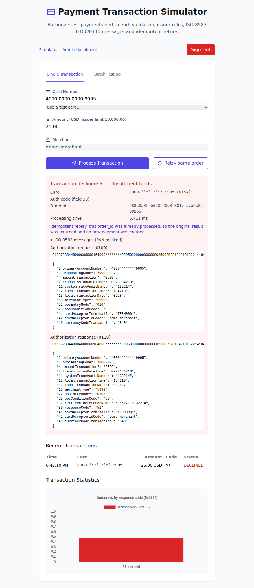
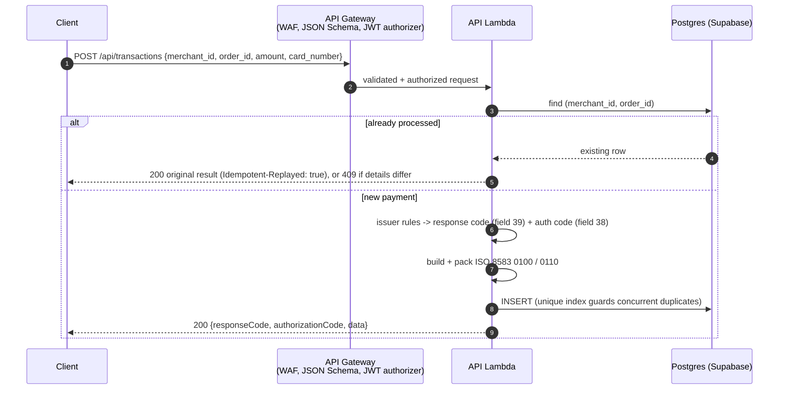
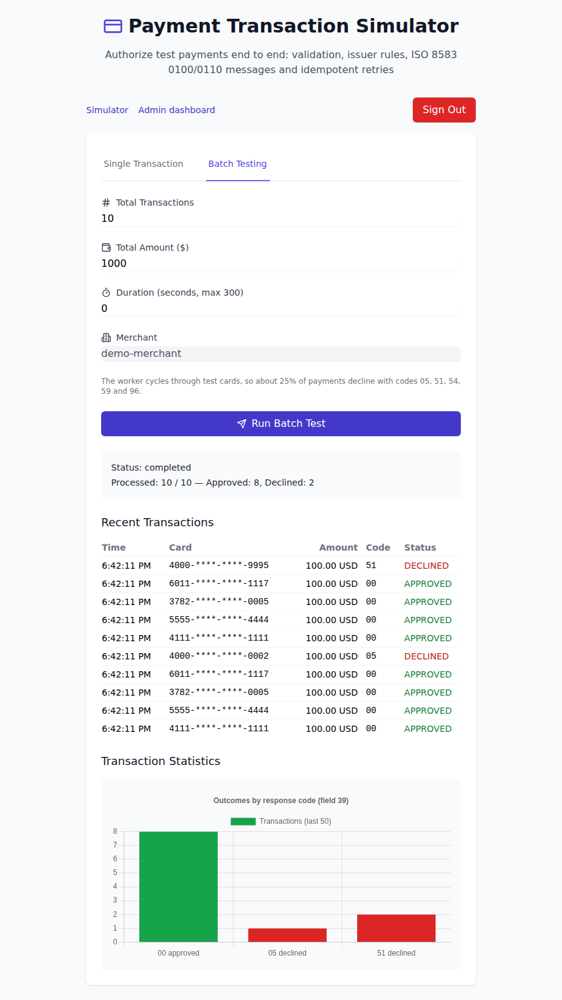
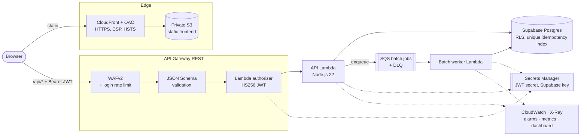
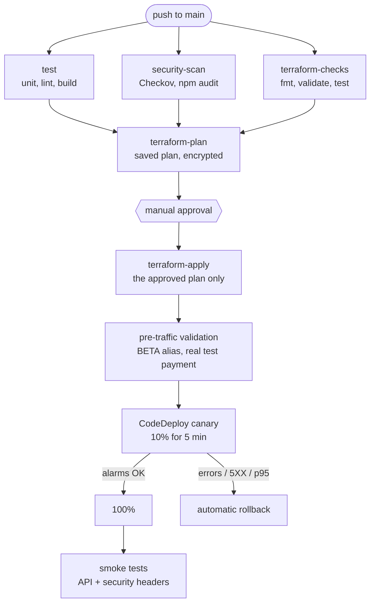

# Payment Transaction Simulator

A card-payment **authorization simulator** that speaks real ISO 8583 —
packed `0100`/`0110` messages with a primary bitmap, deterministic issuer
decisions with real response codes, and database-enforced idempotency — running
on **secure, observable, automated AWS serverless infrastructure**.

No real money moves and no real cardholder data is processed: every card is a
test card. What is real is the engineering around it.



---

## Highlights

**Payments**

- **ISO 8583 codec** — MTI, 64-bit primary bitmap, fixed/LLVAR fields, STAN,
  RRN, auth code (field 38) and response code (field 39); every message is
  packed, unpacked and round-trip tested. Stored copies have the PAN masked.
- **Deterministic issuer rules** — Luhn check, card-scheme detection, amount
  limit and test cards for each decline path. Same input, same answer.
- **Idempotency enforced by the database** — `UNIQUE (merchant_id, order_id)`:
  a retry replays the original result; reusing an order id with different
  details returns `409`. Concurrent duplicates are resolved by Postgres.
- **Exact money handling** — amounts are validated to two decimals and handled
  in minor units, so `19.99` is `1999` in field 4, not `1998.9999…`. Batch
  amounts are split to the exact cent.
- **Redelivery-safe batch worker** — SQS is at-least-once, so the worker uses
  deterministic order ids, resumes a half-finished batch without duplicates,
  retries infrastructure errors, and marks the batch `failed` before the DLQ.

**Platform**

- **Serverless backend** — API Lambda (Node.js 22) behind API Gateway, a JWT
  Lambda authorizer, and an SQS-driven worker for batch load tests.
- **Defence in depth** — JSON Schema validation at the gateway (and again in
  the Lambda), WAFv2 with a login-specific rate limit, per-function IAM roles,
  secrets only in Secrets Manager, CSP/HSTS on the frontend, and a database
  CHECK constraint that rejects an unmasked PAN.
- **Observability as code** — X-Ray, structured logs with PAN redaction,
  approval/decline business metrics, WAF logs with the `Authorization` header
  redacted, alarms, a dashboard and a cost budget.
- **CI/CD** — GitHub Actions with OIDC and SHA-pinned actions; enforcing
  Checkov and `npm audit`; an offline `terraform test`; an encrypted saved plan
  that is applied exactly after human approval; a real test payment against
  the new version before any traffic moves; a CodeDeploy canary with
  alarm-driven rollback; and post-deploy smoke tests.

---

## The payment path



### Issuer rules

Evaluated in order (`lambda/authorization.js`):

| Condition                                  | Field 39 | Meaning                         |
|--------------------------------------------|----------|---------------------------------|
| PAN fails the Luhn check                   | `14`     | Invalid card number             |
| Amount not positive                        | `13`     | Invalid amount                  |
| Amount above 10,000.00                     | `61`     | Exceeds withdrawal amount limit |
| Test card `4000000000000002`               | `05`     | Do not honor                    |
| Test card `4000000000009995`               | `51`     | Insufficient funds              |
| Test card `4000000000000069`               | `54`     | Expired card                    |
| Test card `4000000000000259`               | `59`     | Suspected fraud                 |
| Test card `4000000000000119`               | `96`     | System malfunction              |
| Anything else                              | `00`     | Approved (auth code issued)     |

A malformed request (wrong types, 3 digits instead of 16, sub-cent amounts) is
a `400`. A well-formed card that fails Luhn is a business decline (`14`), not
a malformed request — the same distinction a real acquirer makes.

### ISO 8583 fields used

`2` PAN (LLVAR) · `3` processing code · `4` amount (n12, minor units) ·
`7` transmission date/time · `11` STAN · `12`/`13` local time/date · `18` MCC ·
`22` POS entry mode · `25` POS condition (e-commerce) · `37` RRN · `38` auth
code · `39` response code · `41` terminal id · `42` merchant id · `49`
currency (ISO 4217 numeric).

The codec rejects bad data instead of truncating it: an 18-character merchant
id cannot be silently cut to fit field 42, which is also why
`allowed_merchant_id` is validated in Terraform.

### Batch load tests

`POST /api/process-batch` returns `202` with a `batch_id` immediately; the
worker processes the batch from SQS while the client polls
`GET /api/batches/{id}`. The worker cycles through test cards, so about 25%
of payments decline with codes 05, 51, 54, 59 and 96.



---

## Architecture



Each function has its own IAM role (`terraform/iam.tf`):

| Role         | JWT secret | Supabase secret | SQS send | SQS consume |
|--------------|:----------:|:---------------:|:--------:|:-----------:|
| API          | read       | read            | yes      | —           |
| Authorizer   | read       | —               | —        | —           |
| Batch worker | —          | read            | —        | yes         |

---

## Tech stack

| Layer          | Technology                                                                 |
|----------------|----------------------------------------------------------------------------|
| Frontend       | React 18, TypeScript, Vite, Tailwind CSS                                   |
| Backend        | AWS Lambda (Node.js 22), API Gateway (REST), SQS                           |
| Payments       | ISO 8583:1987 ASCII codec, Luhn, BIN-based scheme detection                |
| Auth           | HS256 JWT, bcrypt, API Gateway TOKEN authorizer                            |
| Data           | Supabase (PostgreSQL) with Row Level Security                              |
| Secrets        | AWS Secrets Manager                                                        |
| Edge           | CloudFront + OAC, response-headers policy, private S3                      |
| Security       | WAFv2, JSON Schema request validation, per-function IAM                    |
| Observability  | X-Ray, CloudWatch (logs, metric filters, dashboard, alarms), SNS, Budgets  |
| IaC            | Terraform (S3 state + DynamoDB lock), `terraform test` with mocks          |
| CI/CD          | GitHub Actions (OIDC), Checkov, npm audit, AWS CodeDeploy                  |
| Tests          | `node:test` (Lambda), Vitest (frontend), ESLint                            |

---

## Repository structure

```
.
├── frontend/                 React app, served via CloudFront
│   └── src/
│       ├── components/       forms, sidebar, ui primitives, admin dashboard
│       ├── services/         api.ts (fetch + Bearer), auth.ts (token storage)
│       └── types/            API types + the test-card list
├── lambda/                   one package, three handlers
│   ├── lambda.js             API router: login, payments, batches
│   ├── authorizer.js         API Gateway TOKEN authorizer
│   ├── batch-worker.js       SQS consumer (idempotent, resumable)
│   ├── payments.js           idempotency -> authorization -> ISO 8583 -> persistence
│   ├── authorization.js      issuer rules and response codes
│   ├── iso8583.js            codec + 0100/0110 builders
│   ├── pan.js                Luhn, scheme detection, masking
│   ├── store.js              Supabase and in-memory persistence
│   ├── secrets.js            runtime Secrets Manager resolver
│   ├── log.js                structured JSON logs with PAN redaction
│   ├── local-server.js       local dev API (not deployed)
│   └── test/                 node:test suites
├── terraform/
│   ├── lambda.tf  iam.tf  secrets.tf     functions, roles, secrets
│   ├── api_gateway.tf  waf.tf            REST API, validation, WAF + logging
│   ├── batch-worker.tf                   SQS, DLQ, worker
│   ├── frontend.tf                       S3, CloudFront, security headers
│   ├── observability.tf  codedeploy.tf   alarms, metrics, dashboard, canary
│   ├── main.tf  budget.tf  backend.tf …  package, budget, state
│   └── tests/plan.tftest.hcl             offline plan test (mocked providers)
├── supabase/                 schema.sql (idempotent), rls.sql
├── .github/workflows/ci-cd.yml
├── appspec.yml               reference CodeDeploy AppSpec (generated in CI)
└── index.html                project showcase page
```

---

## Local development

No AWS account or Supabase project is needed: the local API runs the real
handlers and authorizer with an in-memory store.

```bash
# API on http://localhost:3001 (login: admin / admin)
cd lambda && npm install && npm run dev:api

# Frontend on http://localhost:5173
cd frontend && npm install
VITE_API_BASE_URL=http://localhost:3001 npm run dev
```

Checks run in CI, runnable locally:

```bash
cd lambda   && npm test                          # 47 tests
cd frontend && npm run lint && npm test && npm run build
cd terraform && terraform init -backend=false && terraform validate && terraform test
```

The in-memory store (`DATA_STORE=memory`) refuses to start inside AWS Lambda,
so it can never be enabled in a deployed function by mistake.

---

## Configuration

Everything comes from GitHub **Secrets** and **Variables**; nothing sensitive
lives in the repository.

### GitHub Actions secrets

| Secret                    | Purpose                                                                  |
|---------------------------|--------------------------------------------------------------------------|
| `AWS_REGION`              | Deployment region (the stack uses `us-east-1`)                           |
| `AWS_DEPLOY_ROLE_ARN`     | IAM role assumed via OIDC (no static keys)                               |
| `TF_STATE_BUCKET`         | S3 bucket for Terraform state (passed via `-backend-config`)             |
| `TF_STATE_LOCK_TABLE`     | DynamoDB table for state locking                                         |
| `TF_PLAN_ENCRYPTION_KEY`  | Long random passphrase that encrypts the saved plan artifact             |
| `SUPABASE_URL`            | Supabase project URL                                                     |
| `SUPABASE_KEY`            | Supabase **service_role** key; stored in Secrets Manager by Terraform    |
| `JWT_SECRET`              | Long random string for signing JWTs; stored in Secrets Manager           |
| `ADMIN_USERNAME`          | Admin login username                                                     |
| `ADMIN_PASSWORD_HASH`     | **bcrypt hash** of the admin password (never the plaintext)              |

```bash
openssl rand -base64 48                                          # JWT_SECRET, TF_PLAN_ENCRYPTION_KEY
node -e "console.log(require('bcryptjs').hashSync('YOUR_PASSWORD', 10))"   # ADMIN_PASSWORD_HASH
```

### GitHub Actions variables

| Variable            | Purpose                                                                         |
|---------------------|---------------------------------------------------------------------------------|
| `VITE_API_BASE_URL` | API stage URL, e.g. `https://xxxx.execute-api.us-east-1.amazonaws.com/prod`     |

### Optional Terraform variables

`alarm_email` (alarm and budget notifications), `monthly_budget_usd`
(default `10`), `allowed_merchant_id` (default `demo-merchant`, at most 15
characters because it is ISO 8583 field 42).

---

## Deployment

1. **Bootstrap once:** create the S3 state bucket, the DynamoDB lock table and
   the OIDC deploy role, and store their names/ARN as secrets.
2. **Set** the secrets and variables above, and create a `production`
   environment with required reviewers (the approval gate).
3. **Apply the database schema:** run `supabase/schema.sql`, then
   `supabase/rls.sql`. Both are idempotent — re-run them after every upgrade
   that changes them.
4. **Push to `main`.** On the very first run, set `VITE_API_BASE_URL` from the
   `api_gateway_invoke_url` output and run again; the API id is stable after that.

### CI/CD pipeline



Pull requests run the first three jobs only.

- **Supply chain** — every action is pinned to a commit SHA; Checkov runs from
  a pinned PyPI version rather than a floating action tag.
- **Enforcing scans** — Checkov and `npm audit --audit-level=high` fail the
  build. Accepted risks are suppressed inline, next to the resource, with a
  written reason (see *Security scanning*).
- **What is reviewed is what ships** — the plan job saves a plan; the apply job
  applies *that file*. If the state moved in between, Terraform rejects the
  stale plan instead of applying something nobody approved.
- **Plans are encrypted** — a saved plan contains variable values (secrets) in
  plain text, and workflow artifacts are readable by anyone with read access
  to the repository. The plan and the exact build outputs it references are
  encrypted with `TF_PLAN_ENCRYPTION_KEY` and kept for one day.
- **Pre-traffic validation** — invokes the new version on its BETA alias
  directly: wrong password → `401`, database reachable through the Secrets
  Manager key, and a real test payment approved with code `00` (its order id
  is derived from the commit, so re-runs replay instead of adding rows).
- **Canary** — CodeDeploy shifts LIVE 10% → 100% over 5 minutes and rolls back
  on the Lambda-error, API-5XX or p95-latency alarm. These alarms use
  60-second periods so they can fire inside the bake window.
- **Smoke tests** — schema rejection (`400`), wrong password (`401`), protected
  routes without a token (`401/403`), and CSP/HSTS/nosniff/frame headers on the
  frontend. No real credentials are used.

---

## Security posture

- **Cardholder data** — the PAN is masked before any write or log. Logs are
  redacted recursively by key, WAF logs redact the `Authorization` header,
  API Gateway never logs bodies, and a database CHECK constraint rejects an
  unmasked PAN even if application code regressed.
- **Secrets** — the JWT secret and the Supabase service_role key live in
  Secrets Manager and are read at runtime; no function has them in its
  environment. Each role can read only the secrets it needs.
- **Authentication** — timing-safe login (an unknown username pays the same
  bcrypt cost), HS256 pinned in the authorizer (`alg: none` and algorithm
  confusion are rejected), issuer checked, and the policy scoped to this API
  and stage instead of `*`. A regex on the `Authorization` header rejects
  malformed tokens before the authorizer is even invoked.
- **Input validation** — JSON Schema models at the gateway, repeated in the
  Lambda with stricter rules (two-decimal amounts, PAN length, order-id
  charset, supported currencies).
- **Edge** — private S3 via OAC, HTTPS only, CSP limited to this origin and its
  own API, HSTS, `X-Frame-Options: DENY`, `nosniff`. The CSP is the main
  mitigation for keeping the JWT in `localStorage` (a documented trade-off).
- **Network abuse** — WAF managed rules, a general per-IP rate limit, a
  stricter one on `/api/login`, and API Gateway throttling.
- **Database** — RLS enabled and forced on every table, grants revoked from
  `anon` and `authenticated`; only the server-side service_role key has access.

### Security scanning

Checkov reports **0 failed checks**. Every suppression is an inline
`#checkov:skip=<ID>:<reason>` on the resource itself, so the reason is
reviewed together with the code. The accepted risks fall into four groups:

- **Cost-driven for a demo stack** — customer-managed KMS keys, one-year log
  retention, CloudFront WAF and access logs, S3 replication.
- **Not applicable to this design** — Lambda in a VPC (there is nothing
  private to reach), function DLQs (synchronous and SQS invocations), API
  caching (per-user, frequently changing data), client certificates (browser
  clients).
- **Platform constraints** — minimum TLS version needs a custom domain; SNS
  encryption with the AWS-managed key breaks CloudWatch alarm delivery.
- **Scanner false positives** — the WAF association lives in a separate resource.

---

## Observability

- **Tracing** — X-Ray on API Gateway and all three functions.
- **Logs** — structured JSON application logs with PAN redaction in dedicated
  log groups (30-day retention), JSON API access logs including latency,
  validation errors and WAF status, and WAF request logs.
- **Business metrics** — every authorization logs a `PAYMENT_APPROVED`,
  `PAYMENT_DECLINED` or `PAYMENT_REPLAYED` token; metric filters turn these
  into the `TransactionSimulator/Payments*` metrics.
- **Dashboard** — Lambda, API Gateway, WAF, approvals vs declines, worker
  errors and queue/DLQ depth.
- **Alarms → SNS** — Lambda errors and throttles, API 5XX, API p95 latency,
  WAF block spikes, batch-worker errors, DLQ not empty.
- **Cost** — AWS Budget with 80% / 100% notifications.

---

## Testing

| Suite                 | Runner          | Covers                                                                                                   |
|-----------------------|-----------------|----------------------------------------------------------------------------------------------------------|
| Lambda (47 tests)     | `node:test`     | ISO 8583 pack/unpack and bitmaps, issuer rules and test cards, Luhn/scheme/masking, idempotent replay and 409, float-safe amounts, PAN never persisted or logged, batch counts, exact cent split, SQS redelivery, failure marking, auth and authorizer (`alg:none`, wrong issuer, tampering), CORS, validation |
| Frontend (10 tests)   | Vitest          | token storage and expiry, API client (base URL, bearer, 401 handling, 409 message), test-card list       |
| Infrastructure        | `terraform test`| full plan with mocked providers: per-function roles, no secrets in env, encrypted queues, supported runtime, canary alarms, merchant-id validation |
| Static analysis       | ESLint, `tsc`, Checkov | TypeScript/React lint and types; Terraform and GitHub Actions misconfiguration |

---

## Known limitations & trade-offs

Stated on purpose, so they can be discussed in a review:

- **The issuer is simulated.** Decisions come from deterministic rules and test
  cards; there is no card network, clearing or settlement, no reversals
  (`0400`) and no secondary bitmap.
- **Single admin user.** Credentials come from the environment; see the
  Cognito migration path below.
- **Canary signals need traffic.** The rollback alarms are threshold-based; on
  a very low-traffic deploy they may never see enough requests to fire. The
  pre-traffic payment check partly compensates.
- **AWS-managed encryption keys.** A customer-managed KMS key (with a key
  policy for CloudWatch and Budgets) would also allow encrypting the alarm topic.
- **Secrets in Terraform state.** Terraform writes secret values to state. The
  state bucket is encrypted and private, and plan artifacts are encrypted, but
  anyone with state access can read them.
- **JWT in `localStorage`.** Readable by JavaScript; mitigated by the strict
  CSP. An `httpOnly` cookie would remove the exposure.
- **Batch retry latency.** The queue visibility timeout follows the AWS
  guidance of 6× the worker timeout, so a crashed batch is retried up to an
  hour later.

### Verifying the WAF login rule after deploy

1. AWS console → WAF & Shield → Web ACLs → `transaction-simulator-api-acl`.
2. Open **Sampled requests** for the `LoginBruteForceRateLimit` rule.
3. Send a few requests to `.../prod/api/login` and confirm they appear. The
   rule matches with `ENDS_WITH "/api/login"` because WAF sees the
   stage-prefixed path (`/prod/api/login`); an `EXACTLY` match would silently
   never fire.

---

## Roadmap

- Customer-managed KMS key for secrets, logs, queues and the alarm topic.
- JWT secret rotation with a dual-key verification window in the authorizer.
- Amazon Cognito instead of the single admin (below).
- Lambda code signing.
- Reversals (`0400/0410`) and a settlement report.

## Auth migration path (Cognito)

1. **DB-backed users (interim).** Use the `users` table already designed in
   `supabase/schema.sql`; replace the environment lookup with a row lookup and
   `bcrypt.compare`. JWT issuing and the authorizer stay the same.
2. **Amazon Cognito.** A User Pool owns credentials and issues tokens; the
   custom `POST /api/login` is replaced by Cognito sign-in.
3. **Swap the authorizer.** Use a Cognito authorizer, or verify Cognito's
   RS256 tokens against the pool's JWKS in the existing one. `password_hash`
   is dropped; the table becomes a profile/role mirror keyed by the Cognito `sub`.

Because auth is enforced at the gateway behind a single authorizer, only the
authorizer and the login endpoint change.

---

## Teardown

```bash
cd terraform
terraform init -reconfigure \
  -backend-config="bucket=$TF_STATE_BUCKET" \
  -backend-config="dynamodb_table=$TF_STATE_LOCK_TABLE"

terraform destroy \
  -var="supabase_url=$SUPABASE_URL" -var="supabase_key=$SUPABASE_KEY" \
  -var="jwt_secret=$JWT_SECRET" -var="admin_username=$ADMIN_USERNAME" \
  -var="admin_password_hash=$ADMIN_PASSWORD_HASH"
```

- The state bucket and lock table bootstrap the stack and are not destroyed.
- Both S3 buckets use `force_destroy`, so no manual emptying is needed.
- CloudFront takes several minutes to disable; the destroy appears to hang meanwhile.
- Secrets are scheduled for deletion with a 7-day recovery window. To re-create
  the stack sooner, delete them with
  `aws secretsmanager delete-secret --force-delete-without-recovery --secret-id <name>`.
- Supabase tables live outside AWS; drop them in the Supabase dashboard if needed.
